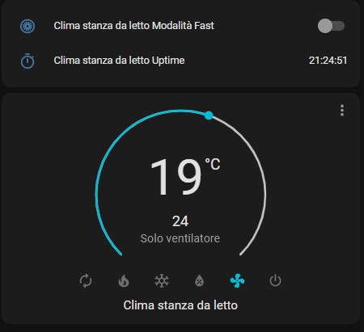
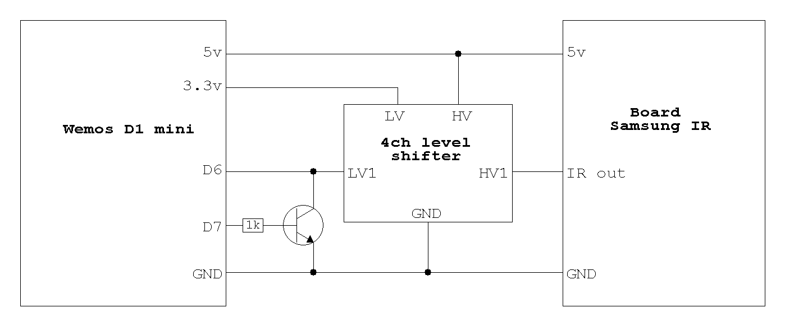
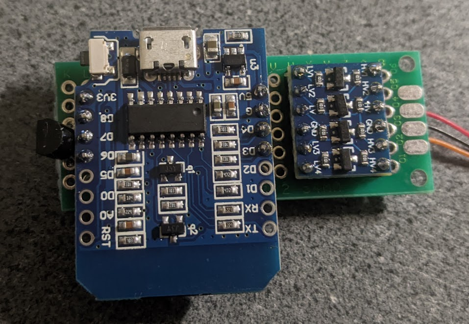
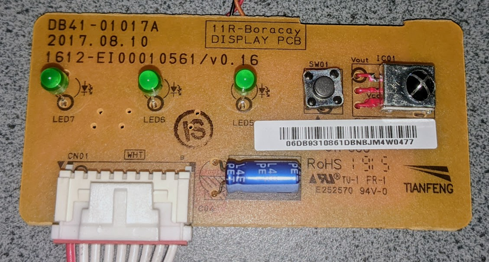
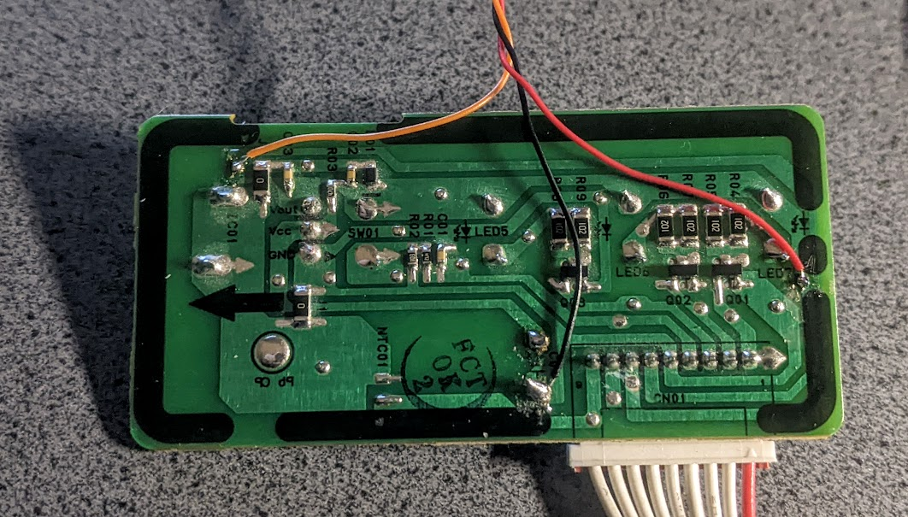
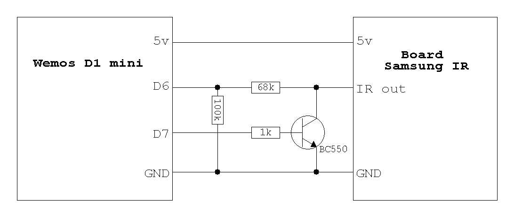
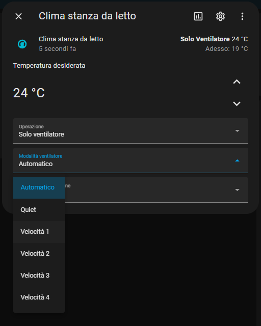

# Esphome Samsung Climate IR

External component ESPHome per controllare un climatizzatore Samsung sprovvisto di interfaccia wifi,
collegandosi direttamente al filo del ricevitore IR interno.

È il porting di [Esphome-Samsung-Climate](https://github.com/mansellrace/Esphome-Samsung-Climate),
riscritto come external component nativo dopo che ESPHome ha rimosso i custom component.
Nel mio caso la modifica è su un Samsung Maldives.



## Perché una nuova versione

Il progetto originale usava `climate: platform: custom` con un file `.h` incluso via `esphome: includes:`,
appoggiandosi alla libreria Arduino [IRremoteESP8266](https://github.com/crankyoldgit/IRremoteESP8266).

- I custom component sono stati **rimossi in ESPHome 2025.2.0**, e l'auto-loader `custom_components/` in 2026.6.0.
- `IRrecv`/`IRsend` della libreria gestiscono il pin per conto proprio e non possono convivere con
  `remote_receiver`/`remote_transmitter` di ESPHome.

Questa versione implementa il protocollo Samsung A/C nativamente sopra `remote_base`, senza nessuna
libreria esterna: la configurazione è validata da ESPHome e non c'è più codice C++ da copiare a mano.

## Hardware

Invariato rispetto alla versione precedente. Il circuito va inserito dentro il climatizzatore vicino alla
scheda frontale su cui è montato il ricevitore IR, e si collega alla scheda Samsung in soli tre punti:
alimentazione e uscita del ricevitore IR.

Si intercetta così la sequenza captata dal telecomando, per sincronizzare lo stato su Home Assistant, e
iniettando sullo stesso pin i comandi generati dal wemos si comanda il climatizzatore.



Poiché il wemos lavora a 3.3 V e il ricevitore IR a 5 V ho interposto un level shifter.

Il transistor serve a invertire la polarità del pin D7 via hardware, così che D7 portato a 0 durante
aggiornamento, blocco o debug non blocchi il ricevitore IR e non impedisca il funzionamento nativo del
telecomando. Io ho usato un BC550 perché ne avevo il cassetto pieno, va bene un qualsiasi NPN generico
(BC547, 2N2222, ecc.).

Il pin D6 è la ricezione dati, il pin D7 la trasmissione.





### Versione 2

Si può usare un partitore resistivo al posto del level shifter.



## Installazione

Copia [example.yaml](example.yaml) nella configurazione del tuo dispositivo ESPHome, tenendo della tua
configurazione iniziale solo la OTA password e la API key, e sistema il nome del sensore di temperatura.
Nessun file da copiare a mano: il componente viene scaricato da GitHub.

```yaml
external_components:
  - source: github://mansellrace/esphome-samsung-climate-ir@main
    components: [samsung_climate_ir]
```

### Configurazione obbligatoria del ricevitore

```yaml
remote_receiver:
  id: ir_rx
  pin:
    number: D6
    inverted: true
  tolerance: 40%
  idle: 25ms
```

- `inverted: true` perché l'uscita del ricevitore IR è attiva bassa.
- **`idle` deve stare sopra i 18 ms**: la trama Samsung contiene una pausa di 17.8 ms subito dopo
  l'header, e con il default di 10 ms verrebbe spezzata in due messaggi illeggibili.
- `tolerance: 40%` riproduce la tolleranza usata dal firmware precedente. Se qualche pressione del
  telecomando non venisse riconosciuta, alzala a 50-55%.

### Configurazione obbligatoria del trasmettitore

```yaml
remote_transmitter:
  id: ir_tx
  pin: D7
  carrier_duty_percent: 100%
```

`carrier_duty_percent: 100%` disattiva la portante a 38 kHz: il mark diventa un livello alto pieno.
È indispensabile, perché il segnale viene iniettato già demodulato sull'uscita del sensore IR e non
irradiato da un LED. Il pin resta non invertito, l'inversione la fa il transistor.

## Configurazione del climate

| Opzione | Tipo | Default | Descrizione |
|---|---|---|---|
| `receiver_id` | ID | — | `remote_receiver` da cui leggere il telecomando. Senza, la sincronizzazione da telecomando non funziona. |
| `transmitter_id` | ID | — | `remote_transmitter` su cui inviare i comandi. |
| `sensor` | ID | — | Sensore della temperatura ambiente, mostrato nella card di Home Assistant. |
| `fan_mode_names` | mappa | — | Rinomina le velocità, vedi sotto. |
| `transmit_on_boot` | bool | `false` | Se `true`, all'avvio ritrasmette via IR lo stato ripristinato dalla flash. |
| `boost_timeout` | tempo | `30min` | Dopo quanto la modalità Fast torna da sola a `none`. `0s` la lascia attiva finché non la cambi. |

Sono disponibili anche tutte le opzioni comuni di [`climate_ir`](https://esphome.io/components/climate/climate_ir/)
(`supports_cool`, `supports_heat`, `visual`, ...).

### Velocità della ventola

Di default il componente espone i fan mode standard di ESPHome — `auto`, `quiet`, `low`, `medium`,
`high` — più il custom `Turbo`, che non ha un equivalente standard.

Con `fan_mode_names` puoi dare un'etichetta a una velocità: in quel caso viene esposta come custom fan
mode con quel nome invece che come standard. Per riprodurre esattamente la tendina della versione
precedente:

```yaml
fan_mode_names:
  quiet: "Quiet"
  low: "Velocità 1"
  medium: "Velocità 2"
  high: "Velocità 3"
  turbo: "Velocità 4"
```

`auto` resta sempre un fan mode standard e non è rinominabile.

### Modalità Fast

La modalità Fast (Powerful) del telecomando è il preset climate `boost`, quindi compare direttamente
nella card di Home Assistant senza switch né script. Si spegne da sola dopo `boost_timeout`, come fa il
climatizzatore, e viene annullata da qualsiasi altro comando. È disponibile solo in raffreddamento e
riscaldamento, come sul telecomando.

### Pulsante beep

```yaml
button:
  - platform: samsung_climate_ir
    samsung_climate_ir_id: clima
    name: "Beep"
```

Silenzia o riattiva il beep di conferma del climatizzatore — quello che suona a ogni comando ricevuto.

Il protocollo Samsung ha un bit di beep (byte 13, bit 2) che è un **toggle**: commuta l'impostazione
sull'unità senza comunicare lo stato risultante. Per questo è un button e non uno switch — ESPHome non
può sapere se in quel momento il climatizzatore stia suonando o meno, sa solo invertire l'impostazione.

Verificato funzionante su Samsung Maldives, ed è documentato anche su AR12TXEAAWKNEU
([IRremoteESP8266#1669](https://github.com/crankyoldgit/IRremoteESP8266/issues/1669)). Su modelli
diversi potrebbe non essere supportato: se premendo il pulsante non cambia nulla, togli il blocco
`button`.

## Funzioni supportate

5 modalità operative (auto / caldo / freddo / deumidificazione / solo ventilazione), temperatura 16-30 °C,
6 velocità di ventola comprese Quiet e Turbo, oscillazione verticale, modalità Fast e silenziamento del
beep. Quando si imposta il climatizzatore dal telecomando l'entità su Home Assistant viene aggiornata.



Non sono implementati, ma il protocollo li prevede: oscillazione orizzontale, display del pannello,
WindFree/Breeze, Econo, ionizzatore, timer e funzione Clean.

## Migrazione dalla versione precedente

1. Elimina `irsamsung.h` dalla cartella `config/esphome/`.
2. Sostituisci il contenuto dello YAML con [example.yaml](example.yaml), tenendo API key, OTA password e
   il nome del tuo sensore di temperatura.
3. Spariscono i blocchi `switch:` (modalità fast) e `script:` (reset_fast): la modalità Fast ora è il
   preset `boost`. L'entità switch `switch.modalita_fast` non esisterà più, quindi vanno aggiornate le
   automazioni che la usavano.
4. Se vuoi mantenere le velocità con i vecchi nomi, tieni il blocco `fan_mode_names` mostrato sopra.

## Sviluppo

```bash
python -m venv .venv
.venv/Scripts/pip install esphome
.venv/Scripts/esphome compile tests/test.yaml
python tests/check_protocol.py
```

`tests/test.yaml` usa il componente da percorso locale e copre sia il caso con i nomi personalizzati sia
quello con i fan mode standard.

`tests/check_protocol.py` rilegge le costanti da `samsung_protocol.h` e verifica che la trama di
spegnimento — l'unica trasmessa verbatim, senza ricalcolo — abbia i checksum che il nostro algoritmo si
aspetta. Non serve un compilatore C++.

## Crediti

Il layout dei bit, i tempi della trama e l'algoritmo di checksum sono un porting del supporto Samsung A/C
di [IRremoteESP8266](https://github.com/crankyoldgit/IRremoteESP8266) (LGPL-2.1) di David Conran e
contributori. Il protocollo è documentato in
[IRremoteESP8266#505](https://github.com/crankyoldgit/IRremoteESP8266/issues/505) e
[#1538](https://github.com/crankyoldgit/IRremoteESP8266/issues/1538).

## Licenza

GPL-3.0, vedi [LICENSE](LICENSE).
